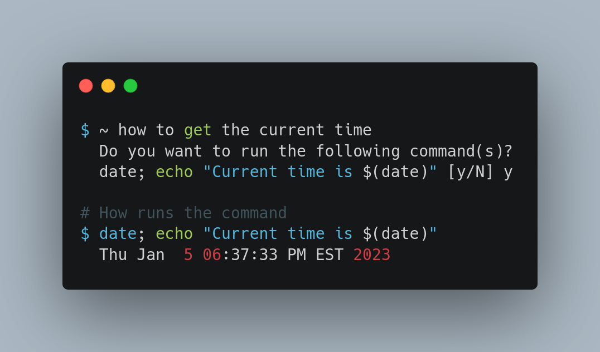

# How

**Disclaimer:** This is currently only for Linux and isn't built for Windows or
Mac.

**How** is an AI-powered tool to create tailored commands all within the
comforts of your shell!



## Installation

You can download the binary from the
[latest release](https://github.com/vandesm14/how/releases/latest).

Or you can build from source (requires [Deno](https://deno.land/)):

```bash
git clone https://github.com/vandesm14/how.git
cd how

chmod +x build.sh
./build.sh
```

## Usage

### Prerequisites

You will need to get an API key from [OpenAI](https://openai.com/). Once you
have that, you can either:

**Use the environment variable**

```bash
HOW_OPENAI_KEY=<your key> how to <your prompt>
```

**Use the config editor**

```bash
how config key <your key>
```

### Prompting the AI

```bash
# how to <your prompt>

$ how to create a new file
# Do you want to run the following command(s)?
# touch file.txt [y/N] y
# $ touch shane.txt
```

## Contributing

Pull requests are welcome. For major changes, please open an issue to discuss
what you would like to change.

## FAQ

### How do I change my privacy settings?

When you first run **how** (such as `how to get the time`), our magical wizard
will ask you a few questions. This will include whether you would like to send
extra contextual data in the prompt to OpenAI such as your username and OS
distro.

You can change this at any time by running
`how config anonymous <true | false>`. This will update the config file located
at `~/.config/how/config.json`.

### Where is the data stored?

All data related to **how** is stored in the `~/.config/how` directory. This
includes the config file and history.

### How do I edit the data sent to OpenAI?

Configuring the data sent to OpenAI is not editable via config. Instead, it
requires a rebuild of the binary. To do this, you will need to:

1. Clone the repository
2. Edit the `lib/prompt.ts` file to your liking
3. Build the project (see [Installation](#installation))
